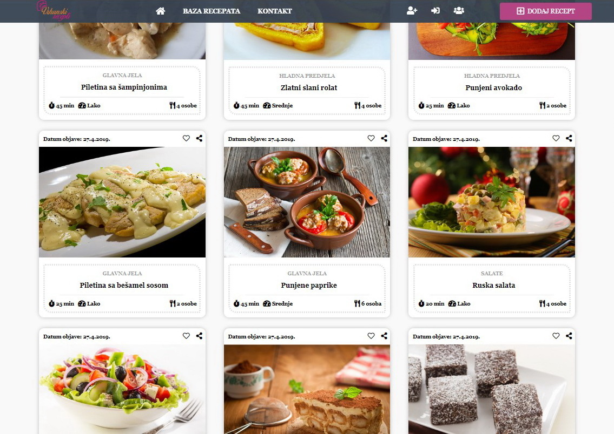
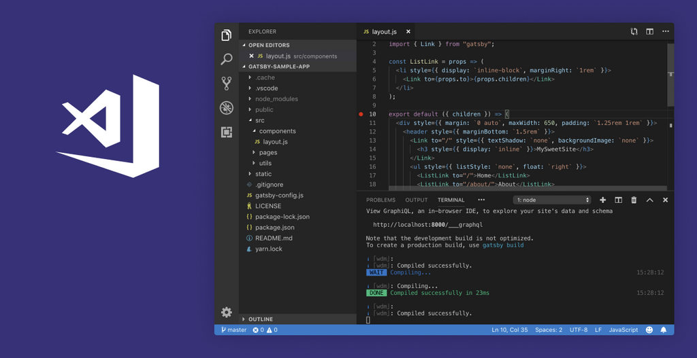

# Projekat - Baza kulinarskih recepata - 

[![build-shield]](#)
[![code-clean]](#)
[![dependencies]](#)
[![browsers]](#)


<br />
<p align="center">
  <a href="">
    
  </a>

<h3 align="center">Web sajt sa bazom kulinarskih recepata</h3>

## Project
### About project:
> Projekat - Web sajt "Vrhunski recepti" - baza kulinarskih recepata, osnovne funkcionalnosti:
- Prikaz kulinarskih recepata na stranici
- Dinamičko iscrtavanje recepata (JavaScript) na stranici, direktno iz JSON baze
- Pretraga recepata po kategoriji, nazivu, vremenu pripreme i drugim parametrima, brza pretraga i napredna pretraga
- Sortirani najnovije dodati recepti
- Prikaz pojedinacnog recepta sa vise informacija i njegovo dinamicko iscrtavanje (JavaScript) na stranici, sa podacima iz JSON baze
- Mogućnost dodavanja recepata u omiljene recepte, kao i štampanje recepta
- Mogucnost download recepta u PDF formatu
- Registracija korisnika
- Log-in korisnika
- Korisnik ima mogucnost da doda novi recept kroz formu za unos podataka i dodavanje slika
- Korisnički panel za manipulaciju receptima, brisanje svojih recepata i izmena (edit) recepta, kao i prikaz omiljenih recepata
- Prikaz svih recepata odabranog autora recepta
- Izdvojene kategorije recepata sa brojem najnovijih recepata u toj kategoriji i mogucnost njihovog prikaza na stranici

> Projekat je uradjen uz pomoc HTML-a, CSS-a, JavaScript-a, i koriscenjem tehnologija:
- jQuery - za lakšu manipulaciju DOM-om
- WebPack kao module bundler, sa PostCSS-om i Babel-om
- Mock JSON server - baza podataka (sa receptima i kirisnicima) u JSON formatu
- Axios - pravljenje upita i komunikacija sa serverom - bazom (GET, POST, PATCH, DELETE metode)
- Jest - za pisanje testova za testiranje JavaScript koda

![product-screenshot]
<p align="center">
    

## Technology used

<p align="center">
    

[![html]](#)&nbsp;
[![css]](#)&nbsp;
[![js]](#)&nbsp;
[![jquery]](https://jquery.com)&nbsp;
[![json]](https://my-json-server.typicode.com/)&nbsp;
[![webpack]](https://webpack.js.org/)&nbsp;
[![axios]](https://www.npmjs.com/package/axios)
<br>
<p align="center">
    
<br>

## Installation

> 1. Clone the repo
```sh
git clone https://github.com/Danilo3110/kulinarski-recepti.git
```
> 2. Install NPM packages
```sh
yarn install or npm install or npm i
```
> 3. Start JSON server
```sh
yarn server or npm run server
```

## Project structure
```sh
.
├── dist
│   ├── js
│   │   └── main.bundle.js
│   └── main.bundle.css
│
├── node_modules
├── src
│   ├── css
│   │   └── main.css
│   ├── img
│   ├── js
│   │   ├── vendor
│   │   │   └── jquery.js
│   │   └── main.js
│   ├── .edittorconfig
│   ├── add_recipe.html
│   ├── Favicon.ico
│   ├── index.html
│   ├── recipe.html
│   ├── register.html
│   └── user_panel.html
│
├── webpack
│   ├── loaders.js
│   ├── plugins.js
│   ├── postcss.config.js
│   └── webpack.config.js
│
├── .gitignore
├── babel.config.js
├── db.json
├── package.json
├── README.md
└── yarn.lock
```

## Developers on this project

[![built]](https://github.com/Danilo3110)<br>

> Project Link: [Git Hub Repo](https://github.com/Danilo3110/kulinarski-recepti)

<br>

## Acknowledgements

* [Img Shields](https://shields.io)
* [Animate.css](https://daneden.github.io/animate.css)
* [Loaders.css](https://connoratherton.com/loaders)
* [Font Awesome](https://fontawesome.com)

<!-- LINKS & IMAGES -->
[build-shield]: https://img.shields.io/badge/build-passing-brightgreen.svg?style=popout
[code-clean]: https://img.shields.io/badge/code_style-standard-brightgreen.svg?style=popout
[dependencies]: https://img.shields.io/badge/dependencies-up_to_date-brightgreen.svg?style=popout
[browsers]: https://img.shields.io/badge/browsers-Chrome|Firefox|Opera|Brave-blue.svg?style=popout
[built]: https://img.shields.io/badge/BUILT_BY_DEVELOPER-_Danilo_Lukic-important.svg?style=for-the-badge&logo=git
[html]: https://img.shields.io/badge/HTML-v5-red.svg?style=popout-square&logo=html5
[css]: https://img.shields.io/badge/CSS-v3-blue.svg?style=popout-square&logo=css3
[js]: https://img.shields.io/badge/JavaScript-ES6-yellow.svg?style=popout-square&logo=javascript
[jquery]: https://img.shields.io/badge/jQuery-v3.3.1-violet.svg?style=popout-square&logo=jquery
[json]: https://img.shields.io/badge/JSON-v0.14.2-green.svg?style=popout-square&logo=json
[webpack]: https://img.shields.io/badge/WebPack-v4.29.6-blue.svg?style=popout-square&logo=webpack
[axios]: https://img.shields.io/badge/AXIOS-v0.18-lightblue.svg?style=popout-square&logo=codesandbox
[product-screenshot]: ./forReadme/SS_recipes.jpg